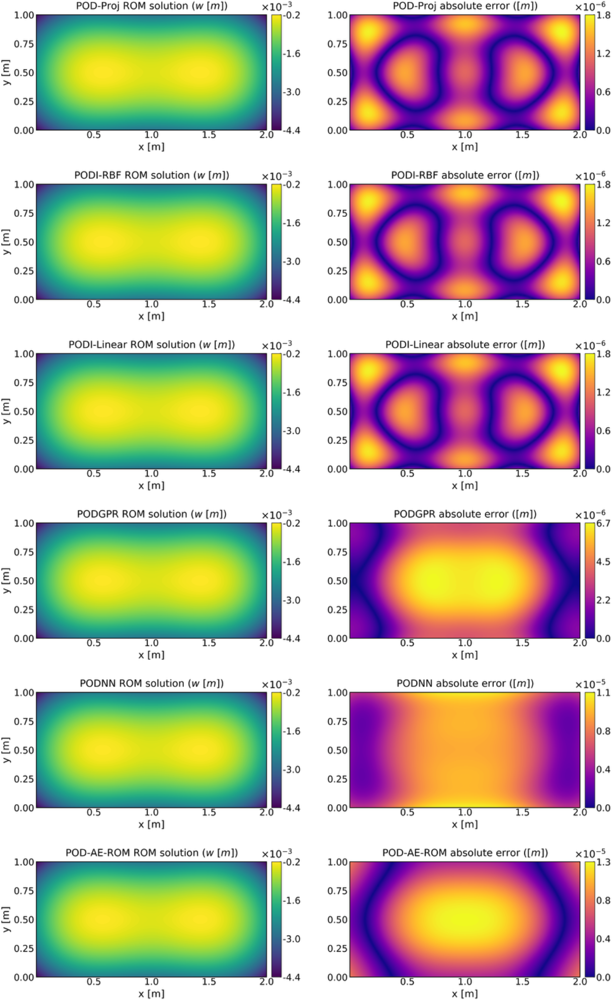

# Parametric Plate ROM

Research software for high-fidelity and reduced-order modelling of parameterized orthotropic Kirchhoff--Love plate systems, with emphasis on thermomechanical plate bending, foundation/contact effects, snapshot generation, POD preprocessing, intrusive projection benchmarks, and non-intrusive reduced-order models.

The current repository state is the Project-2 ROM reproducibility workflow through `v0.8-project2-rom-reporting-safe`: data loading, POD preprocessing, intrusive POD projection, PODI-RBF, PODI-linear, POD-GPR, POD-NN, POD-AE, and report-ready post-processing.



## Current status

This repository is under active research development. The present stable milestone is intended for internal thesis/paper reproducibility and method comparison.

| Milestone | Status | Scope |
|---|---:|---|
| `v0.1-project2-legacy-safe` | complete | protected legacy Project-2 solver baseline |
| `v0.2-project2-snapgen-safe` | complete | snapshot-generation migration layer |
| `v0.3-rom-data-loader-safe` | complete | external snapshot archive discovery/loading |
| `v0.4-project2-pod-preprocessing-safe` | complete | POD basis construction and train/test splits |
| `v0.5-project2-rom-suite-architecture-safe` | complete | intrusive/non-intrusive suite registry |
| `v0.6-project2-legacy-aligned-rom-methods-safe` | complete | notebook-aligned PODI, POD-GPR, POD-NN, POD-AE |
| `v0.7-project2-neural-alignment-safe` | complete | centered-POD field-loss fix and POD-AE e2e fine-tuning |
| `v0.8-project2-rom-reporting-safe` | complete | CSV/Markdown/LaTeX/JSON/PNG/PDF reporting |

True nonlinear intrusive POD-Galerkin is intentionally marked as `capable-disabled`. It should remain disabled until the full FEniCS residual/Jacobian, boundary-condition, interface, contact, and thermal-coupling reconstruction path is migrated and validated.

## What this repository contains

The main Project-2 workflow is:

```text
snapshot archive
  -> data loader
  -> POD preprocessing
  -> intrusive POD projection benchmark
  -> non-intrusive ROMs: PODI-RBF / PODI-linear / POD-GPR / POD-NN / POD-AE
  -> report-ready comparison tables and plots
```

Core modelling ingredients include:

- orthotropic Kirchhoff--Love plate bending;
- C0 interior-penalty finite element structure inherited from the legacy solver;
- Winkler-type elastic foundation/contact effects;
- optional panel/interface coupling;
- 3D heat-to-plate thermomechanical reduction for Project-2 datasets;
- POD reduced spaces for displacement `w` and thermal driver `theta`/`T1`;
- legacy-aligned non-intrusive regressors for parameter-to-POD-coefficient maps.

## Repository structure

```text
parametric-plate-rom/
├── configs/
│   ├── data_locations.template.yml        # copy to data_locations.local.yml
│   └── thermomechanical/                  # small example configurations
├── docs/
│   ├── figures/                           # README/report figures
│   ├── theory/                            # model notes
│   └── workflows/                         # reproducibility and method guides
├── legacy/project2/
│   └── THERMOMECHANICAL_FOM_ROM_legacy.py # protected reference implementation
├── scripts/project2/
│   ├── check_rom_dataset.py               # inspect available archives
│   ├── build_pod_dataset.py               # build POD bases and coefficients
│   ├── run_rom_suite.py                   # run intrusive/non-intrusive ROM suite
│   └── report_rom_suite.py                # build report tables and plots
├── src/paramplate/
│   ├── io/                                # data-root and snapshot archive loaders
│   ├── rom/                               # POD, intrusive, non-intrusive ROMs
│   ├── project2/                          # Project-2 definitions and wrappers
│   └── snapshots/                         # snapshot-generation support
└── tests/                                 # unit/smoke tests for the workflow
```

Generated datasets, snapshot archives, POD bases, model outputs, and reports are kept outside the Git repository in a separate data root. This avoids committing large `.npz` archives and generated figures.

## Installation

Create or activate a scientific Python environment. For the ROM/data/reporting workflow, the package requires NumPy, SciPy, pandas, Matplotlib, scikit-learn, tqdm, PyYAML, joblib, tabulate, and PyTorch. FEniCS/dolfin is required for the legacy high-fidelity solver/snapshot-generation path, but not for reading already-generated `.npz` snapshot archives.

From the repository root:

```bash
python -m pip install -e .
```

Run the test suite used for the current Project-2 ROM workflow:

```bash
python -m pytest tests/test_snapshot_archive_loading.py
python -m pytest tests/test_pod_preprocessing.py
python -m pytest tests/test_rom_suite_architecture.py
python -m pytest tests/test_legacy_aligned_nonintrusive.py
python -m pytest tests/test_torch_runtime_safety.py
python -m pytest tests/test_centered_pod_field_loss_alignment.py
python -m pytest tests/test_run_rom_suite_cli.py
python -m pytest tests/test_rom_suite_reporting.py
```

Expected result for the current milestone: all tests pass.

## External data layout

Create a separate data directory, for example:

```text
/Users/<user>/Documents/PHD_WORKS/parametric-plate-rom-data/
```

Then copy and edit the local data-location configuration:

```bash
cp configs/data_locations.template.yml configs/data_locations.local.yml
```

`configs/data_locations.local.yml` should not be committed. A typical Project-2 layout is:

```text
parametric-plate-rom-data/
└── paper2_thermomechanical/
    ├── campaigns/
    │   ├── baseline/
    │   │   └── <CASE>/
    │   │       └── SNAPSHOTS__<CASE>.npz
    │   ├── addon_gapfill/
    │   └── merged/
    ├── rom_training/
    │   ├── pod_bases/
    │   └── suites/
    │       ├── intrusive/
    │       ├── nonintrusive/
    │       └── reports/
    ├── convergence/
    ├── results/
    └── logs/
```

The snapshot archive expected by the current Case-2 tutorial is:

```text
paper2_thermomechanical/campaigns/baseline/
└── CASE_02_SUMMER_1MP1TP__PANEL_MONOLITHIC_NV0_NH0__BC_FREE_EDGE__LOAD_PATCH/
    └── SNAPSHOTS__CASE_02_SUMMER_1MP1TP__PANEL_MONOLITHIC_NV0_NH0__BC_FREE_EDGE__LOAD_PATCH.npz
```

## Quick start: Project-2 Case-2 ROM benchmark

Set the case name:

```bash
CASE="CASE_02_SUMMER_1MP1TP__PANEL_MONOLITHIC_NV0_NH0__BC_FREE_EDGE__LOAD_PATCH"
```

Build POD preprocessing artifacts:

```bash
python scripts/project2/build_pod_dataset.py \
  --case "$CASE" \
  --write \
  --overwrite
```

Run all currently enabled ROM methods:

```bash
python scripts/project2/run_rom_suite.py \
  --suite all \
  --case "$CASE" \
  --write \
  --overwrite
```

Generate report-ready outputs:

```bash
python scripts/project2/report_rom_suite.py \
  --case "$CASE"
```

Report outputs are written to:

```text
<DATA_ROOT>/paper2_thermomechanical/rom_training/suites/reports/<CASE>/
```

Expected report files:

```text
rom_suite_comparison.csv
rom_suite_comparison.md
rom_suite_comparison_table.tex
rom_suite_report.json
rom_suite_w_test_error.png
rom_suite_w_test_error.pdf
rom_suite_theta_test_error.png
rom_suite_theta_test_error.pdf
```

## Basis-size selection

The reduced basis dimension is selected in the POD preprocessing stage. The recommended rule is:

1. choose the smallest rank satisfying a strict cumulative POD energy threshold;
2. verify the POD-projection train/test error;
3. increase the rank only if the projection error or downstream ROM error still decreases meaningfully;
4. do not increase the rank only because a neural model can train more coefficients.

For the current Case-2 benchmark, the fresh run selects:

| field | rank | retained energy | POD-projection test error |
|---|---:|---:|---:|
| displacement `w` | 3 | `0.999980833902` | `2.282533e-03` |
| thermal driver `theta` | 1 | `0.999990329083` | `9.530887e-04` |

The POD-projected result is the projection/truncation lower bound for all non-intrusive models using the same basis.

## ROM methods and default hyperparameters

The non-intrusive methods are intentionally aligned with the legacy `THERMOMECHANICAL_FOM_ROM.py` notebook rather than tuned independently.

| method | purpose | main defaults |
|---|---|---|
| POD-projected | intrusive projection lower bound | uses saved POD basis and test snapshots |
| PODI-RBF | interpolation baseline | `RBFInterpolator`, `thin_plate_spline`, smoothing `0.0`, nearest fallback |
| PODI-linear | interpolation baseline | `LinearNDInterpolator`, nearest fallback |
| POD-GPR | probabilistic coefficient regression | one GP per POD coefficient, RBF kernel, constant kernel, white kernel, `alpha=1e-9`, 10 restarts |
| POD-NN | neural coefficient regression | MLP `(128, 96, 64)`, ELU, AdamW, 2500 coefficient epochs, 275 field-finetune epochs |
| POD-AE | dense latent coefficient model | coefficient AE `(128, 96, 64)`, latent MLP `(128, 96, 64)`, 2500 AE epochs, 2500 latent epochs, 500 e2e epochs |

More details are in [`docs/workflows/project2_rom_methods_and_hyperparameters.md`](docs/workflows/project2_rom_methods_and_hyperparameters.md).

## Current Case-2 interpretation

For the current Case-2 benchmark, the expected interpretation is:

- use `pod-projected` as the projection/truncation lower bound;
- `pod-gpr` is the strongest non-intrusive method for this case;
- `pod-nn` is the strongest neural model after the centered-POD field-loss correction;
- `pod-ae` is a useful latent baseline but weaker than POD-GPR/POD-NN here;
- `podi-rbf` is a simple strong interpolation baseline;
- `podi-linear` is the weakest method for this parameter map.

## Detailed documentation

- [`docs/workflows/project2_repository_usage_guide.md`](docs/workflows/project2_repository_usage_guide.md) — tutorial-style end-to-end usage.
- [`docs/workflows/project2_data_layout_and_snapshots.md`](docs/workflows/project2_data_layout_and_snapshots.md) — external data folders and snapshot placement.
- [`docs/workflows/project2_rom_methods_and_hyperparameters.md`](docs/workflows/project2_rom_methods_and_hyperparameters.md) — methods, architectures, epochs, kernels, optimizer settings.
- [`docs/workflows/project2_full_reproducibility_run.md`](docs/workflows/project2_full_reproducibility_run.md) — clean-cache final run from scratch.
- [`docs/workflows/project2_rom_reporting_guide.md`](docs/workflows/project2_rom_reporting_guide.md) — report generation.

## Suggested GitHub About metadata

GitHub repository metadata is edited manually in the right-side “About” panel. Suggested description:

```text
Research software for high-fidelity and reduced-order modelling of parametrized orthotropic Kirchhoff--Love plates with thermomechanical coupling, snapshot generation, POD projection, PODI, POD-GPR, POD-NN, POD-AE, and report-ready ROM benchmarking.
```

Suggested topics:

```text
finite-element-method, reduced-order-modeling, pod, thermomechanics, kirchhoff-love-plates, orthotropic-plates, gaussian-process-regression, neural-networks, autoencoder, scientific-computing
```

## Citation

If you use this repository, cite the thesis/release associated with the exact version used. A `CITATION.cff` file is included for software citation metadata.

## License

The license is not finalized for public release. Check `LICENSE` before redistributing or publishing the code.
