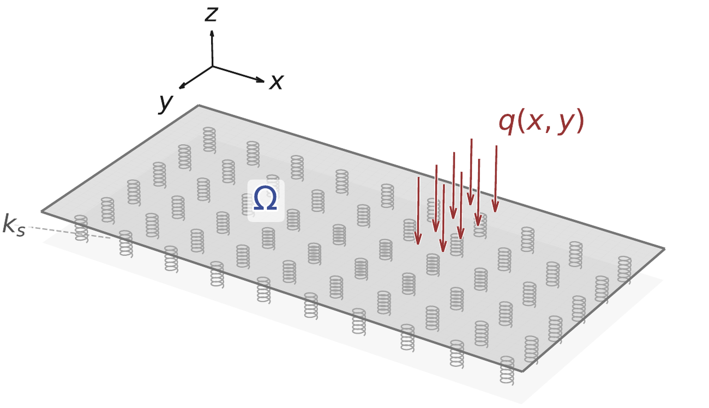

# Parametric Plate ROM

`paramplate` is the computational companion to the dissertation *Parameterized Orthotropic Plate Systems: Numerical Methods and Model Reduction*. It collects full-order, data-generation, verification, and reduced-order workflows for aligned-orthotropic Kirchhoff–Love plates in three settings: nonlinear static mechanics on a regularized unilateral foundation, steady thermomechanical bending coupled to three-dimensional heat conduction, and prescribed-regime transient dynamics. The plate solvers use a symmetric `C0-IPG` discretization; the ROM layer provides metric-aware POD, intrusive or hybrid projection where supported, and field-specific predictive models.

The repository distinguishes lightweight software-path checks from the full dissertation campaigns. Bundled sample arrays are synthetic and do not reproduce the thesis tables or figures. Full finite-element runs require a compatible FEniCS/DOLFIN 2019.1 environment, and several thesis-scale ROM studies require external snapshot archives.

## Study and method scope

| Study | Full-order state and reduced output | Thesis ROM workflows |
|---|---|---|
| Static mechanics | Nonlinear plate displacement; native panel field or transferred displacement output | POD–Galerkin, POD–Proj, PODI–RBF, PODI–Linear, POD–GPR, POD–NN |
| Steady thermomechanics | Coupled 3-D temperature/2-D plate state; separate displacement and thermal-driver `theta` outputs | Hybrid mechanical POD–Galerkin, POD–Proj, PODI–RBF, PODI–Linear, POD–GPR, POD–NN, POD–DL-ROM, field-specific DL-ROM |
| Transient dynamics | Complete displacement trajectory under one prescribed effective foundation regime | POD–Proj, PODI–RBF, PODI–Linear, POD–GPR, POD–NN, POD–DL-ROM with physical parameters and query time |

The thermomechanical FOM is physically coupled although its predictive ROMs are one-field models. The transient predictors are non-causal, time-conditioned field surrogates rather than reduced Newmark propagators. Direct DL-ROM is not an active transient method.

The complete implementation-status table is in [`docs/capability-matrix.md`](docs/capability-matrix.md).

## Representative computational figures

| Static setting | Steady thermomechanical setting | Transient setting |
|---|---|---|
|  |  |  |

These are reduced-size extracts of original computational figures from the final thesis source. Provenance is recorded in [`docs/figures/README.md`](docs/figures/README.md).

## Repository layout

```text
parametric-plate-rom/
├── src/paramplate/          mechanics, thermomechanics, dynamics, ROM, I/O, and plotting modules
├── scripts/                 study, verification, archive, and ROM command-line drivers
├── configs/                 smoke, thesis-campaign, and verification configurations
├── examples/                dependency-separated software-path examples
├── data/sample/             small synthetic archives used by tests and examples
├── docs/                    workflow guides, numerical conventions, schemas, and capability matrix
├── tests/                   unit, regression, CLI, security, schema, and cleanliness checks
├── results/                 ignored generated outputs
├── environment.yml          ROM/data/post-processing environment
└── environment-fenics-2019.yml  reference legacy full-order environment
```

## Installation

For archive, ROM, and post-processing work:

```bash
conda env create -f environment.yml
conda activate paramplate-rom
python -m pip install -e .
```

PyTorch is optional and is needed only for POD–NN, POD–DL-ROM, and DL-ROM:

```bash
python -m pip install -e '.[neural,test]'
```

The full-order solvers require legacy FEniCS/DOLFIN 2019.1, `mshr`, PETSc, and a working linear solver such as MUMPS. `environment-fenics-2019.yml` records the intended dependency family, but package availability varies by platform and channel state. FEniCS-specific imports are lazy, so data and ROM utilities can be imported without DOLFIN. The active package does not require RBNiCS. The PETSc-to-SciPy transient path currently requires a serial DOLFIN run.

## Quick software-path checks

These commands do not require FEniCS:

```bash
python examples/static_navier_smoke.py
python examples/thermal_driver_smoke.py
python examples/newmark_smoke.py
python examples/rom_smoke.py --study mechanical --method podi-rbf --rank 4
python examples/rom_smoke.py --study thermomechanical \
  --output-field thermal_driver --method pod-proj --rank 2
python examples/rom_smoke.py --study dynamics --method podi-linear --rank 3
```

The study drivers compose and validate configurations before an expensive solve:

```bash
python scripts/mechanical/run_workflow.py \
  --config configs/mechanical/smoke.yml --dry-run
python scripts/thermomechanical/run_workflow.py \
  --config configs/thermomechanical/thesis_case2.yml --dry-run
python scripts/dynamics/run_workflow.py \
  --config configs/dynamics/thesis_case2_one_interface.yml --dry-run
```

Configuration ranges are operational: changing a declared sampling interval changes the Latin-hypercube design used by the corresponding snapshot or trajectory driver.

## Verification workflows

The verification drivers expose the reference constructions and comparisons used by the three study chains. Their `--dry-run` modes do not require DOLFIN.

```bash
# Static monolithic Navier comparison
python scripts/mechanical/run_verification.py \
  --config configs/mechanical/verification_monolithic.yml --dry-run

# Static panel-to-monolithic comparison
python scripts/mechanical/run_verification.py \
  --config configs/mechanical/verification_panel_2.yml \
  --reference-config configs/mechanical/verification_panel_monolithic.yml \
  --mode panel --dry-run

# Thermomechanical centered first-moment check
python scripts/thermomechanical/run_verification.py \
  --config configs/thermomechanical/verification_auxiliary_navier.yml \
  --mode thermal-driver

# Coupled FOM against the fixed-driver auxiliary Navier series
python scripts/thermomechanical/run_verification.py \
  --config configs/thermomechanical/verification_auxiliary_navier.yml \
  --mode navier --dry-run

# Transient frequency, time-domain, energy, harmonic, and modal checks
python scripts/dynamics/run_verification.py \
  --config configs/dynamics/verification_base.yml \
  --mode frequencies --dry-run
```

With DOLFIN available, remove `--dry-run` to execute the selected finite-element comparison. The transient driver also provides `single-mode`, `modal`, `energy`, `harmonic`, and `patch-modal` modes. A two-panel comparison uses `configs/dynamics/verification_panel_2.yml` with `configs/dynamics/verification_base.yml` as the monolithic reference. External regular-grid reference fields can be supplied to the static and thermomechanical verification drivers without enabling pickle deserialization.

The drivers recreate the numerical workflow, not the already reported thesis evidence by default. Reproducing the published refinement tables requires the corresponding external fine-mesh or independent-reference artifacts and the full legacy solver environment.

## Full campaigns and external data

Thesis-scale configurations are under `configs/mechanical/`, `configs/thermomechanical/`, and `configs/dynamics/`. They record discretization, sample or trajectory counts, split counts, output ranks, and active methods. Large snapshot databases, complete trajectory archives, raw meshes, and trained checkpoints are intentionally external.

Copy `configs/data_locations.template.yml` to the ignored `configs/data_locations.local.yml`, or set `PARAMPLATE_DATA_ROOT`. Archive schemas and manifest rules are documented in [`docs/data-and-manifests.md`](docs/data-and-manifests.md).

```bash
paramplate-validate-archive /external/path/case2_snapshots.npz \
  --kind thermomechanical
python scripts/common/run_rom.py /external/path/case2_snapshots.npz \
  --study thermomechanical --output-field displacement \
  --method pod-gpr --rank 6
```

Study guides:

- [`docs/workflows/mechanical.md`](docs/workflows/mechanical.md)
- [`docs/workflows/thermomechanical.md`](docs/workflows/thermomechanical.md)
- [`docs/workflows/transient.md`](docs/workflows/transient.md)
- [`docs/workflows/rom.md`](docs/workflows/rom.md)

## Data and checkpoint safety

Normal NPZ loading uses `allow_pickle=False`. Numeric arrays and fixed-width strings are the supported shared-data format. Loading a pickle-backed legacy archive requires an explicit trusted-data opt-in. POD–NN checkpoints use PyTorch's restricted weight-only loader and a validated payload schema; checkpoints should nevertheless come from a trusted source.

Generated data, trained models, local path files, and result directories are excluded by `.gitignore`.

## Testing and continuous integration

```bash
python -m compileall -q src scripts examples
pytest -q -m 'not fenics'
```

Tests marked `fenics` construct or execute high-fidelity paths and require DOLFIN 2019.1 and `mshr`. The dependency-light suite checks configuration composition, operational sampling ranges, paths, safe archive loading, manifests, split determinism and trajectory leakage, POD metric orthogonality, predictive ROMs, restricted neural checkpoint loading, thermal-driver reduction, partitioned coupling, active dynamic degrees of freedom, Newmark integration, analytical references, CLI behavior, documentation links, and release-tree cleanliness.

GitHub Actions runs dependency-light tests, neural smoke tests, and a wheel build. A green workflow does not imply that DOLFIN-dependent campaigns were executed.

## Citation and reuse

Citation metadata are in [`CITATION.cff`](CITATION.cff). No DOI, archived software record, Git tag, or GitHub release is asserted by the repository files.

The source is published for scholarly inspection and computational reproducibility, but **no open-source license is granted**. See [`LICENSE`](LICENSE) before copying, modifying, or redistributing the code.
