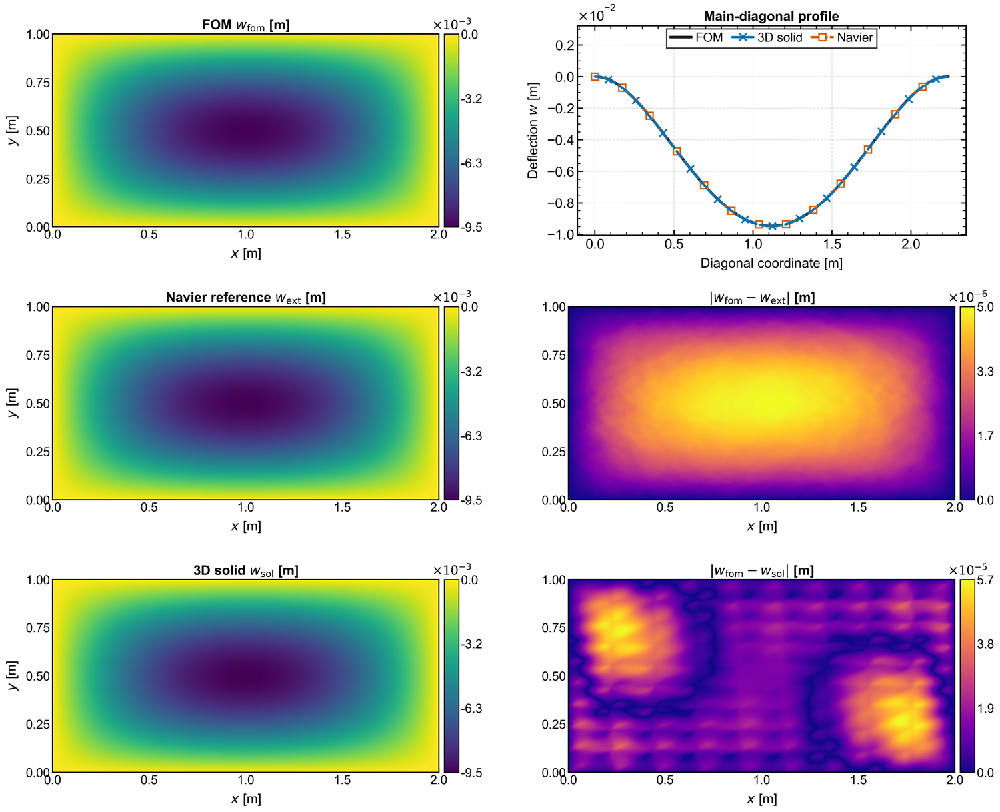
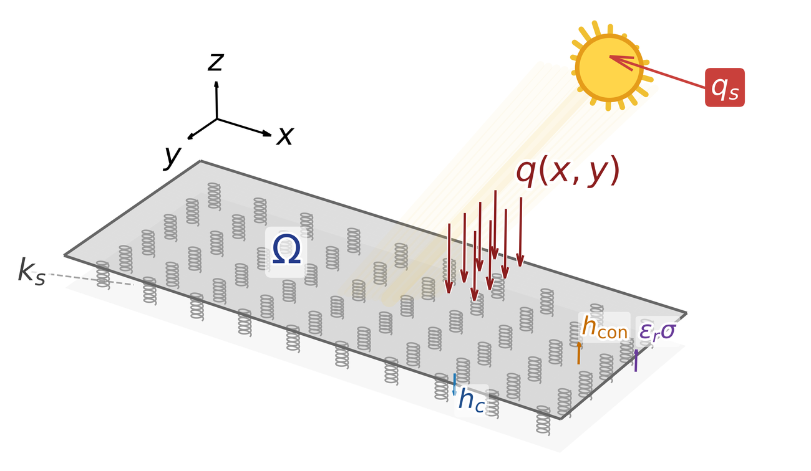
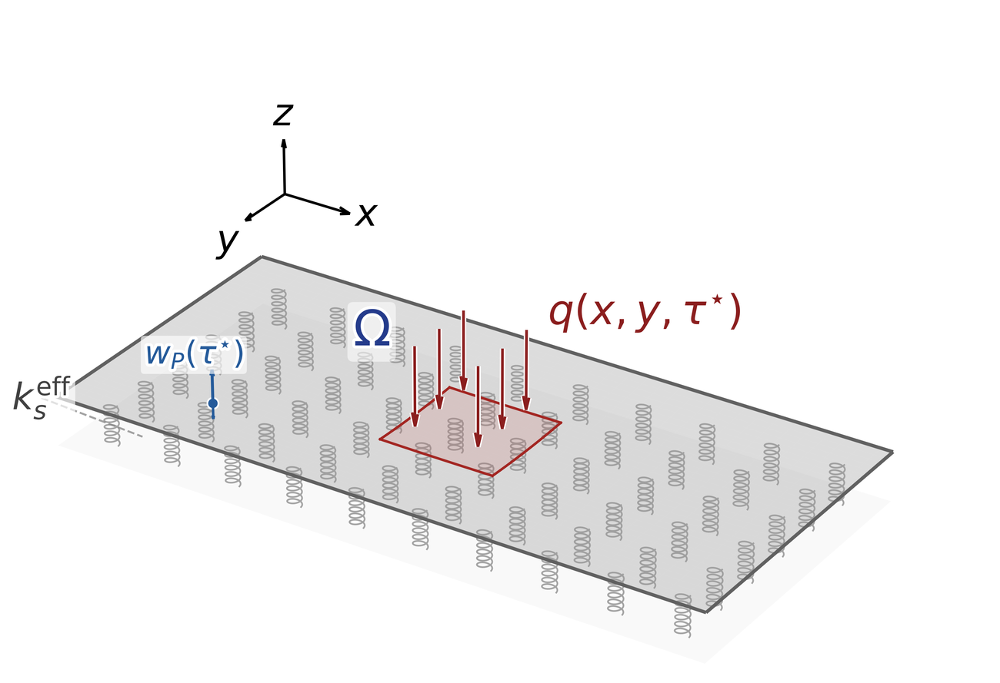

# Parametric Plate ROM

`paramplate` is the computational companion to the dissertation *Parameterized Orthotropic Plate Systems: Numerical Methods and Model Reduction*. It provides finite-element, data, and reduced-order workflows for aligned-orthotropic Kirchhoff--Love plates in three settings: nonlinear static mechanics on a regularized unilateral foundation, steady thermomechanical bending coupled to three-dimensional heat conduction, and prescribed-regime transient dynamics. The plate solvers use a symmetric `C0-IPG` discretization; the ROM layer provides metric-aware POD, intrusive or hybrid projection where supported, and field-specific predictive models.

This repository separates a fast software-path check from the full dissertation campaigns. Bundled smoke arrays are synthetic and do not reproduce thesis tables or figures. Full runs require the thesis configurations, a compatible FEniCS/DOLFIN 2019.1 environment, and in several cases external snapshot archives.

## Study and method scope

| Study | Full-order state and reduced output | Thesis ROM workflows |
|---|---|---|
| Static mechanics | Nonlinear plate displacement; native panel field or transferred displacement output | POD--Galerkin, POD--Proj, PODI--RBF, PODI--Linear, POD--GPR, POD--NN |
| Steady thermomechanics | Coupled 3-D temperature/2-D plate state; separate displacement and thermal-driver `theta` outputs | Hybrid mechanical POD--Galerkin, POD--Proj, PODI--RBF, PODI--Linear, POD--GPR, POD--NN, POD--DL-ROM, field-specific DL-ROM |
| Transient dynamics | Complete displacement trajectory under one prescribed effective foundation regime | POD--Proj, PODI--RBF, PODI--Linear, POD--GPR, POD--NN, POD--DL-ROM with physical parameters and query time |

The thermomechanical FOM is physically coupled although its predictive ROMs are one-field models. The transient predictors are time-conditioned, non-causal field surrogates; they are not reduced Newmark propagators. Direct DL-ROM is not an active transient method.

## Representative computational figures

| Static verification | Steady thermomechanical setting | Transient setting |
|---|---|---|
|  |  |  |

The figures are reduced-size copies of original computational figures from the final thesis source. Their provenance is recorded in [`docs/figures/README.md`](docs/figures/README.md).

## Repository layout

```text
parametric-plate-rom/
├── src/paramplate/          reusable mechanics, thermomechanics, dynamics, ROM, I/O, and plotting code
├── scripts/                 command-line study and ROM drivers
├── configs/                 smoke and thesis-consistent configurations
├── examples/                lightweight, dependency-separated examples
├── data/sample/             small synthetic archives for software-path checks
├── docs/                    workflows, conventions, data schema, and capability matrix
├── tests/                   unit, regression, CLI, schema, and cleanliness checks
├── results/                 ignored generated outputs
├── environment.yml          ROM/data/post-processing environment
└── environment-fenics-2019.yml  reference legacy FOM environment
```

## Installation

For ROM, data, and post-processing work:

```bash
conda env create -f environment.yml
conda activate paramplate-rom
python -m pip install -e .
```

The full-order solvers require legacy FEniCS/DOLFIN 2019.1, `mshr`, PETSc, and a working linear solver such as MUMPS. `environment-fenics-2019.yml` records the intended dependency family, but package availability varies by operating system and conda channel state; it is not a promise that one command recreates every original machine environment. FEniCS-specific imports are lazy, so ROM and archive utilities remain usable without DOLFIN. The active package does not import RBNiCS. The transient PETSc-to-SciPy/Newmark implementation is currently a serial-DOLFIN path.

PyTorch is optional unless POD--NN, POD--DL-ROM, or DL-ROM is used:

```bash
python -m pip install -e '.[neural,test]'
```

## Quick reproducibility

These commands run without FEniCS:

```bash
python examples/static_navier_smoke.py
python examples/thermal_driver_smoke.py
python examples/newmark_smoke.py
python examples/rom_smoke.py --study mechanical --method podi-rbf --rank 4
python examples/rom_smoke.py --study thermomechanical --output-field thermal_driver --method pod-proj --rank 2
python examples/rom_smoke.py --study dynamics --method podi-linear --rank 3
```

The study drivers can validate composed configurations before a full-order run:

```bash
python scripts/mechanical/run_workflow.py \
  --config configs/mechanical/smoke.yml --dry-run
python scripts/thermomechanical/run_workflow.py \
  --config configs/thermomechanical/thesis_case2.yml --dry-run
python scripts/dynamics/run_workflow.py \
  --config configs/dynamics/thesis_case2_one_interface.yml --dry-run
```

With a compatible FEniCS environment, remove `--dry-run` to execute a smoke solve. The static Navier action remains dependency-light:

```bash
python scripts/mechanical/run_workflow.py \
  --config configs/mechanical/smoke.yml --action navier
```

## Full thesis workflows and external data

The thesis-scale configurations are under `configs/mechanical/`, `configs/thermomechanical/`, and `configs/dynamics/`. Case files compose the corresponding `thesis_base.yml` and record discretization, sample counts, split counts, output ranks, and active methods. Large snapshot databases, complete trajectory archives, raw meshes, and trained checkpoints are intentionally external.

Copy `configs/data_locations.template.yml` to the ignored `configs/data_locations.local.yml`, or set `PARAMPLATE_DATA_ROOT`. Archive schemas and validation commands are documented in [`docs/data-and-manifests.md`](docs/data-and-manifests.md). For example:

```bash
paramplate-validate-archive /external/path/case2_snapshots.npz --kind thermomechanical
python scripts/common/run_rom.py /external/path/case2_snapshots.npz \
  --study thermomechanical --output-field displacement \
  --method pod-gpr --rank 6
```

See the study guides:

- [`docs/workflows/mechanical.md`](docs/workflows/mechanical.md)
- [`docs/workflows/thermomechanical.md`](docs/workflows/thermomechanical.md)
- [`docs/workflows/transient.md`](docs/workflows/transient.md)
- [`docs/workflows/rom.md`](docs/workflows/rom.md)

## Testing

```bash
python -m compileall -q src scripts examples
pytest -q -m 'not fenics'
```

Tests marked `fenics` construct or execute full-order paths and require DOLFIN 2019.1 and `mshr`. The dependency-light suite checks configuration composition, paths, archive schemas, split determinism and leakage prevention, POD metric orthogonality, interpolation/regression, deep-model smoke paths, thermal-driver reduction, coupling acceptance, active dynamic DOFs, Newmark integration, CLI behavior, documentation links, and repository cleanliness.

## Citation and license

Citation metadata are in [`CITATION.cff`](CITATION.cff). No DOI or software release record is asserted. The repository license has not yet been selected; [`LICENSE`](LICENSE) is an explicit placeholder and should be replaced before public distribution or acceptance of external contributions.
